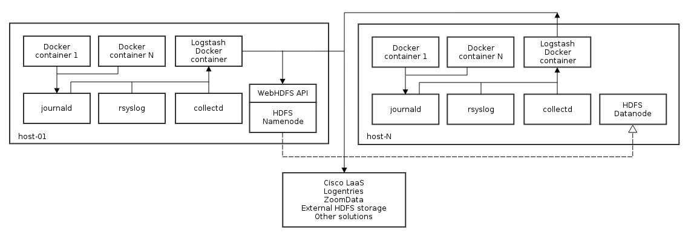

Logstash
--------

Logging role for deploying and managing `Logstash <http://logstash.net>`_ 1.5 with Docker and systemd.

The idea is to have Logstash container running on each host. This allows us to send logs, as well as some other events, to the input of the Logstash service. Leveraging powerful Logstash filters, we can alter the events, extend them with any required additional information and finally send them to a central logs store. The last one can be anything including an external HDFS storage or a 3-rd party application (`Logentries <https://logentries.com>`_, `ZoomData <http://www.zoomdata.com>`_, etc). It's a classical system administration task: by storing all logs in a central location, we gain some benefits such as ability to debug and monitor services.

This simplified diagram depicts how the Logstash role works:

Variables
---------

Check this file for the Logstash default configuration and available variables: `roles/logstash/defaults/main.yml <https://github.com/CiscoCloud/microservices-infrastructure/blob/qa/features-master-integration/roles/logstash/defaults/main.yml>`_

Pay attention that default output is completely disabled, meaning Logstash will not send events anywhere. This was done in purpose until we have a working prototype either from the Cisco LaaS or ZoomData teams.

Example
-------

Let's configure Logstash to send logs into HDFS. For this to work, you will need to have the HDFS role deployed and working. Beware, at the time of this writing, the HDFS role is still under active development.

Change these variables to the following values:::

    logstash_output_webhdfs: yes
    logstash_webhdfs_host: host-01

Make sure that your WebHDFS hostname was set to the proper host with the HDFS namenode running.

As soon as you modify the variables, rerun your playbooks to apply the changes for the Logstash role only:::

    ansible-playbook -i inventory/1-datacenter site.yml --extra-vars=@security.yml --tags=logstash

Now, login to the host-01 and run a simple command to verify that Logstash really sends some output data:::

    docker logs logstash

Let's check that we are able to retrieve the collected data from HDFS. Run the following commands on the host-01 node:::

    hdfs dfs -ls /logs/host-01/
    hdfs dfs -get /logs/host-01/logstash-collectd-2015-01-01.log.gz

Use a tool like ``gunzip`` to extract the compressed file and view its content.
